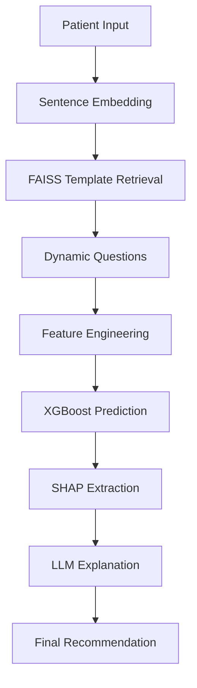
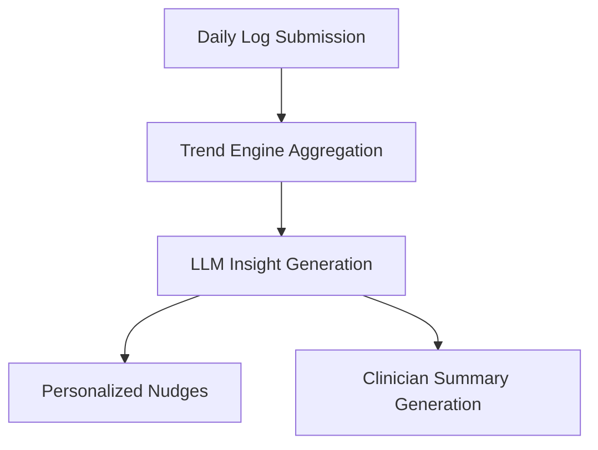

<div align="center">
  <h1>Totem-AI: AI Healthcare Companion Platform</h1>
  <p>An intelligent, production-ready AI healthcare platform combining acute symptom triage and longitudinal chronic disease management.</p>
  <br />
  <p>
    
    
    
    
    
  </p>
</div>

---

## 📖 Overview

Access to timely primary healthcare and self-management support remains a significant challenge, particularly in semi-urban and rural areas. The **Totem-AI Healthcare Companion** bridges this gap by shifting healthcare from a reactive model to a proactive, continuous support system.

**This is not just another chatbot.** It is a privacy-first, low-bandwidth capable AI platform divided into two core engines:
1. **Intelligent Symptom Triage Engine**: Determines urgency (Home Care, Consult in 48h, Immediate Attention) based on semantic understanding of symptoms.
2. **Chronic Disease Management Engine**: Provides long-term monitoring and AI-powered insights for conditions like Type 2 Diabetes and Hypertension.

---

## ✨ Key Features

### Phase 1: AI Symptom Triage System
- **Semantic Understanding**: Uses `SentenceTransformers` (BAAI/bge-small-en-v1.5) and `FAISS` to map natural language complaints to clinical templates.
- **Dynamic Question Engine**: Intelligently asks only missing follow-up questions instead of rigid forms.
- **Explainable Machine Learning**: Utilizes `XGBoost` for prediction, paired with `SHAP` values to guarantee transparency and highlight vital medical features.
- **Safe LLM Integration**: An LLM translates the mathematical prediction and SHAP values into a plain-language explanation, ensuring the LLM *never* makes the medical decision itself.

### Phase 2: Chronic Companion
- **Daily Health Logging**: Track blood glucose, blood pressure, sleep, exercise, and medication adherence.
- **Interactive Data Visualization**: Real-time trend analysis using `recharts` for an intuitive patient dashboard.
- **AI-Powered Weekly Reports**: Analyzes 7-day windows of health logs to generate:
  - Patient Insights (Friendly, empathetic summaries)
  - Actionable Nudges (Specific lifestyle recommendations)
  - Clinician Summaries (Medical-grade dense summaries for doctor visits)
  - Algorithmic Risk Level Tracking

### Cross-Cutting Platform Features
- **Privacy First Architecture**: JWT authentication, consent-based storage, UUID-based identifiers, and anonymized context sent to LLMs.
- **Low Bandwidth Design**: Built as a Progressive Web App (PWA) utilizing IndexedDB for offline storage and background syncing.

---

## 🛠 Technology Stack

### Frontend
- **Framework**: React / Vite
- **Styling & UI**: Tailwind CSS / Framer Motion
- **Visualization**: Recharts
- **Architecture**: Progressive Web App (PWA) with IndexedDB

### Backend
- **Framework**: FastAPI (Python)
- **Database**: PostgreSQL (Persistent storage), Redis (Temporary conversation state)
- **Security**: JWT Authentication

### AI / Machine Learning
- **Embeddings**: Sentence Transformers
- **Vector Search**: FAISS
- **Classification Engine**: XGBoost
- **Explainability**: SHAP (SHapley Additive exPlanations)
- **Generative AI**: Groq / Llama (for patient explanations and weekly reports)

---

## 🚀 Getting Started

### Prerequisites
- Node.js (v18+)
- Python (3.9+)
- PostgreSQL
- Redis

### Backend Setup
1. Navigate to the backend directory:
   ```bash
   cd backend
   ```
2. Create and activate a virtual environment:
   ```bash
   python -m venv venv
   source venv/bin/activate  # On Windows: venv\Scripts\activate
   ```
3. Install dependencies:
   ```bash
   pip install -r requirements.txt
   ```
4. Set up environment variables:
   ```bash
   cp .env.example .env
   # Edit .env with your PostgreSQL, Redis, and API keys
   ```
5. Start the FastAPI server:
   ```bash
   uvicorn app.main:app --reload
   ```

### Frontend Setup
1. Navigate to the frontend directory:
   ```bash
   cd frontend
   ```
2. Install dependencies:
   ```bash
   npm install
   ```
3. Start the development server:
   ```bash
   npm run dev
   ```

---

## 📂 System Architecture

### Triage Workflow



### Chronic Management Workflow



---

## 🔮 Future Enhancements
- Multilingual Support & Voice Assistant integration.
- WhatsApp Chatbot integration for wider accessibility.
- Fine-tuned Medical Sentence Transformers for higher accuracy.
- Advanced predictive forecasting for chronic risk levels.

---
